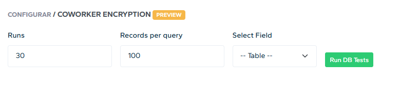

# django-encryption

A simple system to test the performance trade-offs of at-rest encryption on django applications using django-fernet


---

## Architecture and Key Management

This project implements **Envelope Encryption** to secure data at rest. Instead of using a single static key, we use a hierarchy of keys to enhance security and simplify rotation.

* **Master Key (CMK):** A symmetric key generated and managed by AWS KMS (simulated via LocalStack).
* **Data Encryption Keys (DEKs):** These are generated using the Master Key. DEKs are stored in the database and used by the application to encrypt and decrypt sensitive fields.
* **Rotation:** In a production environment, DEKs should be rotated every 3–6 months. This system simulates that lifecycle.

On startup, these DEKs are fetched from the database and loaded into memory to handle encryption/decryption tasks.

---

## Infrastructure Setup

### 1. LocalStack Initialization
LocalStack is used to emulate AWS services locally. Before running the application, ensure LocalStack is running. Refer to the [LocalStack Getting Started Docs](https://docs.localstack.cloud/aws/getting-started/) for installation and setup.

### 2. Configure AWS KMS
Run the following commands via the AWS CLI to set up the encryption environment.

**Create the Master Key:**
```bash
aws kms create-key \
    --key-usage ENCRYPT_DECRYPT \
    --key-spec SYMMETRIC_DEFAULT \
    --description "Master key for encryption/decryption" \
    --endpoint-url=http://localhost:4566
```

**Enable Automatic Key Rotation:**
*Note: Replace `<PASTE_KEY_ID>` with the KeyId returned from the previous command.*
```bash
aws kms enable-key-rotation \
    --key-id <PASTE_KEY_ID> \
    --endpoint-url=http://localhost:4566
```

**Create an Alias:**
```bash
aws kms create-alias \
    --alias-name alias/fernet-master-key \
    --target-key-id <PASTE_KEY_ID> \
    --endpoint-url=http://localhost:4566
```

### 3. Generate DEKs
Use the provided generation script to create the Data Encryption Keys required for the application logic:
```bash
python key_generation.py
```

---

## Application Setup

### Database Configuration
Add your database settings to the `DATABASES` dictionary within the `baseapp/settings.py` file to establish a connection.

### Initialize the Schema
Run the standard Django migration commands to prepare the database tables:
```bash
python manage.py makemigrations
python manage.py migrate
```

### Seed Performance Data
Populate the database with generated fake data to use for benchmarking:
```bash
python import_to_db.py
```

---

## Running Performance Tests

Once the application is running, use the dashboard to begin testing.

1.  **Select Model:** Navigate to the page for the model you wish to test.
2.  **Set Parameters:** Choose the number of runs and the number of records to fetch.
3.  **Define Scope:** Choose between fetching a single variable or the entire table.
4.  **Execute:** Press **RUN** to view results.



> **Note:** Currently, there is no UI option to run both the Encrypted and Unencrypted tables simultaneously. Comparison tests must be configured manually within `view_encryption.py`.

---

## Adding New Models

To add new models to the test suite:

1.  **Define Models:** Add two models to your app—one with standard Django fields and a duplicate version using encrypted fields (e.g., `EncryptedTextField`).
2.  **Create Interface:** Copy an existing HTML template from the `portal` directory and update the URLs to point to your new views.
3.  **Implement Logic:** Copy the logic from `view_encryption.py` for an existing model and customize it to match your new model fields.
4.  **Sync:** Run migrations and the data import script to finalize the setup.
